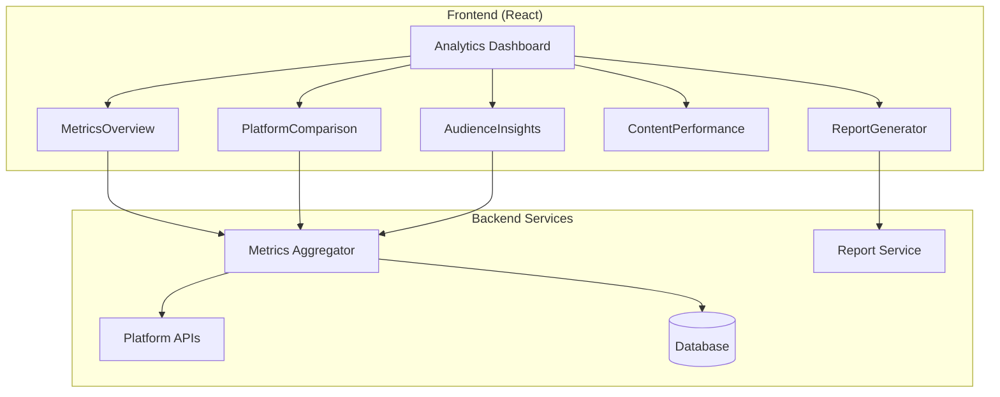

# Design Document: Analytics Dashboard

## Overview

The Analytics Dashboard aggregates social media metrics from multiple platforms, providing unified insights through interactive charts, audience analysis, and automated reporting.

## Architecture



## Components

### MetricsOverview
Key metrics cards with trend indicators and sparklines.

### PlatformComparison
Side-by-side bar charts comparing platform performance.

### AudienceInsights
Demographic pie charts and growth line graphs.

### ContentPerformance
Ranked content list with engagement metrics.

### ReportGenerator
Report builder with section selection and export options.

## Data Models

```javascript
// Analytics Model
{
  period: { start: Date, end: Date },
  metrics: {
    followers: number,
    engagementRate: number,
    reach: number,
    impressions: number
  },
  byPlatform: [{
    platform: string,
    followers: number,
    engagement: number,
    posts: number
  }],
  audience: {
    demographics: { age: object, gender: object, location: object },
    peakTimes: string[]
  },
  topContent: [{
    id: string,
    engagement: number,
    reach: number
  }]
}
```

## Correctness Properties

### Property 1: Time Period Filtering
*For any* selected time period, metrics SHALL only include data within that range.
**Validates: Requirements 1.2, 1.3**

### Property 2: Engagement Rate Calculation
*For any* platform, engagement rate SHALL equal (interactions / reach) * 100.
**Validates: Requirements 2.3**

## Testing Strategy

- Unit tests for metric calculations
- Property tests for date filtering
- Integration tests for API aggregation
