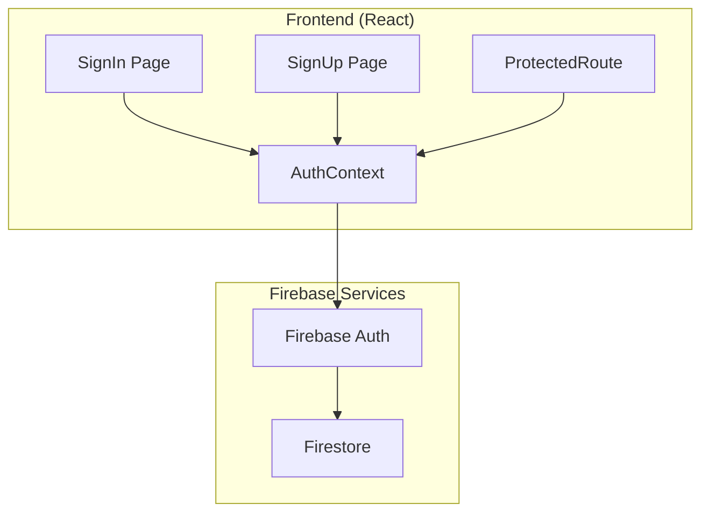

# Design Document: Authentication

## Overview

The Authentication system uses Firebase Authentication for secure user management, supporting email/password and social login methods with persistent sessions.

## Architecture



## Components

### SignIn Page
Login form with email/password and social login buttons.

### SignUp Page
Registration form with validation and terms acceptance.

### ProtectedRoute
HOC that redirects unauthenticated users to login.

### AuthContext
React context providing auth state and methods throughout the app.

## Data Models

```javascript
// User Model
{
  uid: string,
  email: string,
  displayName: string,
  photoURL: string,
  emailVerified: boolean,
  createdAt: Date,
  lastLoginAt: Date
}

// AuthState
{
  user: User | null,
  loading: boolean,
  error: string | null
}
```

## Correctness Properties

### Property 1: Email Validation
*For any* email input, validation SHALL accept only valid email formats.
**Validates: Requirements 1.2**

### Property 2: Password Strength
*For any* password, validation SHALL require minimum 8 characters.
**Validates: Requirements 1.3**

### Property 3: Session Persistence
*For any* authenticated user, session SHALL persist across page refreshes.
**Validates: Requirements 4.1**

## Testing Strategy

- Unit tests for validation functions
- Property tests for email/password validation
- Integration tests for auth flows
