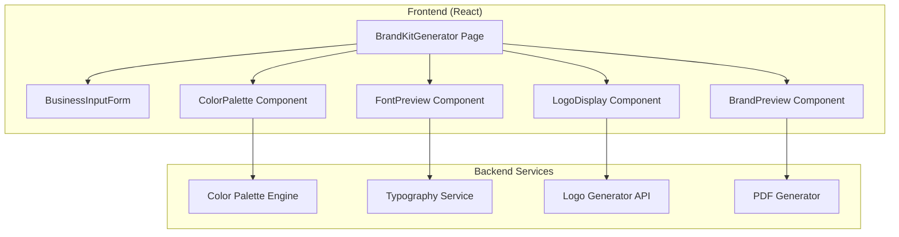

# Design Document: Brand Kit Generator

## Overview

The Brand Kit Generator creates comprehensive brand identity packages using AI. It collects business information, generates color palettes, recommends typography, creates logo concepts, and exports complete brand kits.

## Architecture



## Components

### BrandKitGenerator Page
Main orchestrating component managing multi-step wizard flow.

### BusinessInputForm
Collects business name, industry, values, and style preferences.

### ColorPalette Component
Displays generated palettes with hex codes and accessibility scores.

### FontPreview Component
Shows font pairings with live preview text.

### LogoDisplay Component
Renders logo concepts with background variations.

### BrandPreview Component
Shows complete brand kit preview before export.

## Data Models

```javascript
// BrandKit Model
{
  id: string,
  businessName: string,
  industry: string,
  values: string[],
  colorPalette: {
    primary: { hex: string, rgb: string, name: string },
    secondary: { hex: string, rgb: string, name: string },
    accent: { hex: string, rgb: string, name: string }
  },
  typography: {
    headingFont: string,
    bodyFont: string
  },
  logos: [{
    style: string,
    url: string,
    formats: string[]
  }],
  createdAt: Date
}
```

## Correctness Properties

### Property 1: Palette Generation Count
*For any* valid business input, color generation SHALL return at least 3 palettes.
**Validates: Requirements 2.1**

### Property 2: Color Format Completeness
*For any* generated color, it SHALL include hex, RGB, and name.
**Validates: Requirements 2.3**

### Property 3: Font Pairing Count
*For any* brand kit, typography SHALL include at least 3 font pairings.
**Validates: Requirements 3.2**

## Testing Strategy

- Unit tests for color conversion functions
- Property tests for palette generation
- Integration tests for full brand kit flow
