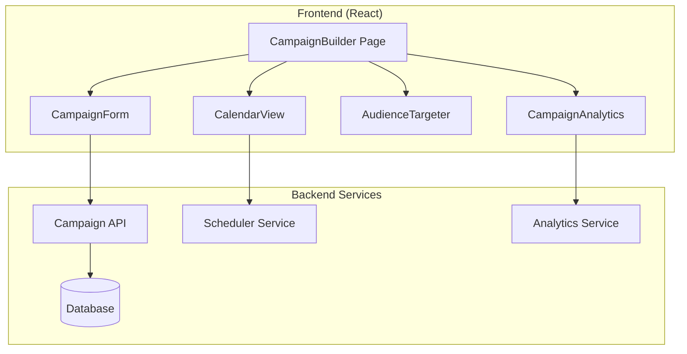

# Design Document: Campaign Builder

## Overview

The Campaign Builder provides comprehensive marketing campaign management with scheduling, audience targeting, and analytics. Built with React and integrated with backend services for data persistence and analytics.

## Architecture



## Components

### CampaignBuilder Page
Main dashboard showing all campaigns with filtering and search.

### CampaignForm
Multi-step form for campaign creation with objective selection.

### CalendarView
Visual calendar showing scheduled content with drag-and-drop.

### AudienceTargeter
Demographic selector with reach estimation.

### CampaignAnalytics
Charts and metrics dashboard for performance tracking.

## Data Models

```javascript
// Campaign Model
{
  id: string,
  name: string,
  objective: 'awareness' | 'engagement' | 'conversion' | 'traffic',
  platforms: string[],
  status: 'draft' | 'active' | 'paused' | 'completed',
  audience: {
    ageRange: [number, number],
    locations: string[],
    interests: string[]
  },
  content: [{
    id: string,
    text: string,
    scheduledAt: Date,
    platform: string
  }],
  analytics: {
    reach: number,
    engagement: number,
    clicks: number
  },
  startDate: Date,
  endDate: Date
}
```

## Correctness Properties

### Property 1: Campaign Requires Name
*For any* campaign creation, name field SHALL be required.
**Validates: Requirements 1.1**

### Property 2: No Past Scheduling
*For any* scheduled content, date SHALL be in the future.
**Validates: Requirements 2.4**

### Property 3: Status Transitions
*For any* campaign, status transitions SHALL follow valid state machine.
**Validates: Requirements 4.3**

## Testing Strategy

- Unit tests for date validation
- Property tests for scheduling logic
- Integration tests for campaign CRUD operations
