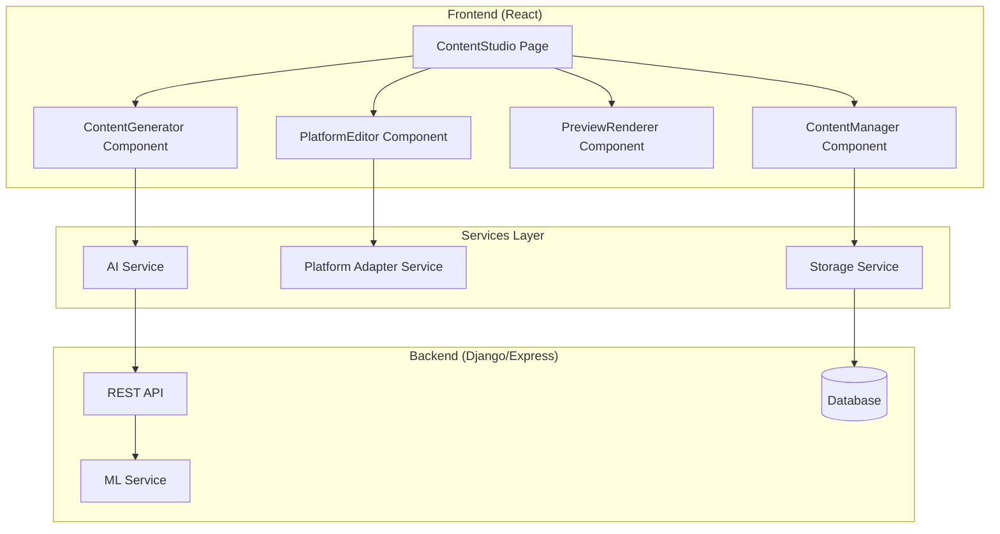

# Design Document: Content Studio

## Overview

The Content Studio is a React-based feature that provides AI-powered social media content generation with platform-specific optimization and real-time previews. The architecture follows a modular component-based design with clear separation between UI, business logic, and data persistence layers.

## Architecture



## Components and Interfaces

### 1. ContentStudio (Main Page Component)

```jsx
// ContentStudio.jsx - Main orchestrating component
const ContentStudio = () => {
  const [prompt, setPrompt] = useState('');
  const [generatedContent, setGeneratedContent] = useState([]);
  const [selectedContent, setSelectedContent] = useState('');
  const [selectedPlatforms, setSelectedPlatforms] = useState(['instagram']);
  const [tone, setTone] = useState('professional');
  const [isGenerating, setIsGenerating] = useState(false);
};
```

### 2. ContentGenerator Component

Handles user input and triggers AI content generation via backend API.

### 3. PlatformEditor Component

Manages platform selection with configs:
- Twitter: 280 chars, 5 hashtags
- Instagram: 2200 chars, 30 hashtags  
- LinkedIn: 3000 chars, 10 hashtags

### 4. PreviewRenderer Component

Platform-specific preview components that simulate actual post appearance.

## Data Models

```javascript
// Content Model
{
  id: string,
  originalPrompt: string,
  text: string,
  tone: 'professional' | 'casual' | 'humorous',
  platforms: [{
    platform: string,
    adaptedText: string,
    hashtags: string[],
    characterCount: number
  }],
  createdAt: Date
}
```

## Correctness Properties

### Property 1: Content Generation Returns Multiple Variations
*For any* valid non-empty prompt, the Content Generator SHALL return at least 3 variations.
**Validates: Requirements 1.2**

### Property 2: Empty Prompt Rejection
*For any* empty or whitespace-only string, validation SHALL reject it.
**Validates: Requirements 1.4**

### Property 3: Platform Character Limit Validation
*For any* content and platform, validation SHALL enforce correct character limits.
**Validates: Requirements 2.2, 2.3, 2.5**

### Property 4: Undo/Redo Round-Trip
*For any* edit sequence, undo/redo SHALL preserve state correctly.
**Validates: Requirements 4.4**

### Property 5: Storage Round-Trip
*For any* saved content, save then load SHALL return equivalent object.
**Validates: Requirements 5.1, 5.2, 5.4**

## Error Handling

- Empty prompts: "Please enter a topic or description"
- Content exceeds limit: Show character count with warning
- API errors: "Unable to generate content. Please try again."

## Testing Strategy

- Unit tests for validation functions
- Property-based tests using fast-check
- Integration tests for full generation flow
