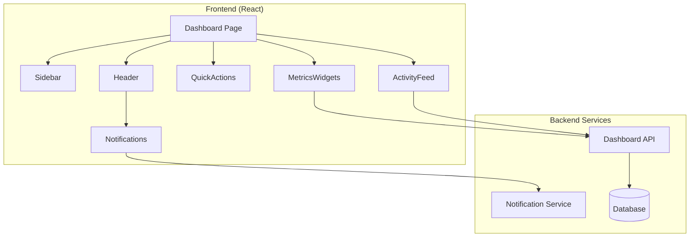

# Design Document: Dashboard

## Overview

The Dashboard serves as the central hub after login, providing navigation, quick actions, metrics overview, and activity tracking in a responsive layout.

## Architecture



## Components

### Sidebar
Collapsible navigation with feature links and icons.

### Header
Top bar with logo, search, user profile, and notification bell.

### QuickActions
Card grid with primary action buttons.

### MetricsWidgets
Summary cards with key statistics and trends.

### ActivityFeed
Scrollable list of recent user actions.

### Notifications
Dropdown panel with notification items.

## Data Models

```javascript
// DashboardData
{
  metrics: {
    contentCreated: number,
    activeCampaigns: number,
    engagementRate: number,
    previousPeriod: object
  },
  recentActivity: [{
    id: string,
    type: string,
    description: string,
    itemId: string,
    timestamp: Date
  }],
  notifications: [{
    id: string,
    type: 'alert' | 'reminder' | 'update',
    message: string,
    read: boolean,
    createdAt: Date
  }]
}
```

## Correctness Properties

### Property 1: Activity Limit
*For any* activity feed, it SHALL display at most 10 items.
**Validates: Requirements 4.1**

### Property 2: Notification Count
*For any* notification bell, count SHALL equal number of unread notifications.
**Validates: Requirements 5.1**

## Testing Strategy

- Unit tests for metric calculations
- Property tests for activity filtering
- Integration tests for navigation
