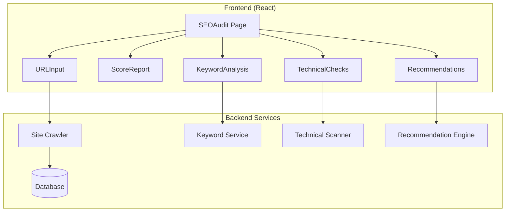

# Design Document: SEO Audit

## Overview

The SEO Audit feature provides comprehensive website analysis for search engine optimization, including technical checks, keyword analysis, and actionable recommendations.

## Architecture



## Components

### URLInput
Input field with URL validation and crawl trigger.

### ScoreReport
Overall SEO score display with breakdown by category.

### KeywordAnalysis
Keyword density charts and suggestions.

### TechnicalChecks
Checklist of technical SEO factors with pass/fail status.

### Recommendations
Prioritized list of improvements with effort estimates.

## Data Models

```javascript
// SEOAudit Model
{
  id: string,
  url: string,
  score: number,
  breakdown: {
    content: number,
    technical: number,
    keywords: number,
    mobile: number
  },
  keywords: [{
    keyword: string,
    density: number,
    placement: string[]
  }],
  technicalIssues: [{
    type: string,
    severity: 'high' | 'medium' | 'low',
    description: string
  }],
  recommendations: [{
    title: string,
    impact: 'high' | 'medium' | 'low',
    effort: 'easy' | 'medium' | 'hard',
    instructions: string
  }],
  createdAt: Date
}
```

## Correctness Properties

### Property 1: Score Range
*For any* audit, score SHALL be between 0 and 100 inclusive.
**Validates: Requirements 1.3**

### Property 2: URL Validation
*For any* invalid URL format, audit SHALL reject with error.
**Validates: Requirements 1.4**

## Testing Strategy

- Unit tests for URL validation
- Property tests for score calculations
- Integration tests for crawler functionality
